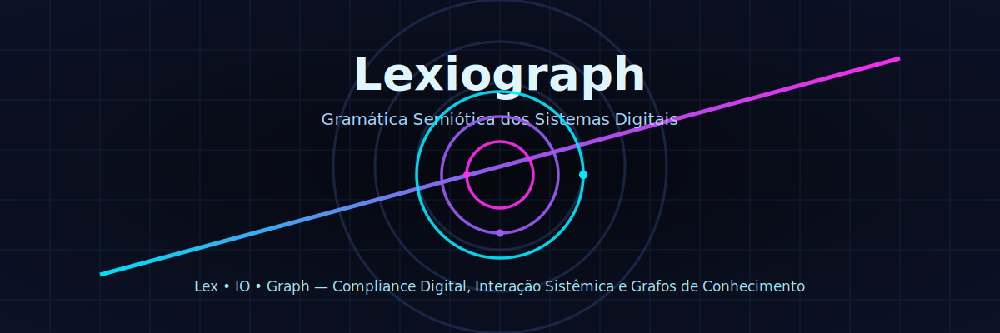

# Lexiograph: Gramática Semiótica dos Sistemas Digitais

<!-- Futuristic banner -->

  

<!-- Badges -->

  
  
  

Lexiograph é mais do que uma marca — é uma linguagem. Uma gramática visual que emerge da interseção entre compliance digital, interação sistêmica e estruturação do conhecimento.

Ao decompor Lexiograph = Lex + IO + Graph, revelamos uma arquitetura semiótica que traduz sistemas digitais em signos, fluxos e grafos.

- Lex representa a lei, a governança algorítmica, o código ético dos sistemas.
- IO simboliza a dinâmica de entrada e saída, a interação entre humanos e máquinas.
- Graph é a grafia, o grafo, a rede de significados que conecta tudo.

Com a assinatura Lex Quantum, propomos uma nova forma de pensar e visualizar o digital: como linguagem, como sistema, como arte.

---

## Visão Geral

  <svg width="100%" height="6" viewBox="0 0 1200 6" xmlns="http://www.w3.org/2000/svg">
    <defs>
      <linearGradient id="sep-neon" x1="0%" y1="0%" x2="100%" y2="0%">
        <stop offset="0%" stop-color="#00eaff"/>
        <stop offset="50%" stop-color="#9b5cf6"/>
        <stop offset="100%" stop-color="#ff2ef2"/>
      </linearGradient>
      <filter id="sep-glow" x="-80%" y="-80%" width="260%" height="260%">
        <feGaussianBlur stdDeviation="2" result="blur"/>
        <feMerge>
          <feMergeNode in="blur"/>
          <feMergeNode in="SourceGraphic"/>
        </feMerge>
      </filter>
    </defs>
    <rect x="0" y="2" width="1200" height="2" fill="url(#sep-neon)" filter="url(#sep-glow)" />
  </svg>

Na era da hiperconectividade, a Lexiograph propõe uma gramática semiótica para interpretar e representar sistemas digitais: unindo governança algorítmica (Lex), fluxos de dados e interação (IO) e grafos de conhecimento (Graph).

Nossa abordagem oferece uma estrutura conceitual e visual para mapear, codificar e comunicar sistemas complexos com clareza, interoperabilidade e profundidade simbólica.

---

## Decomposição Semiótica

  

### Lex — Lei, Compliance, Governança Digital
- Princípios éticos e regulatórios aplicados a sistemas e algoritmos.
- Conformidade técnica, jurídica e operacional.
- Auditoria, transparência e confiabilidade em fluxos e decisões.

### IO — Input/Output, Interação e Fluxo
- Interfaces homem-máquina e protocolos de comunicação.
- Ciclos de entrada, processamento e saída de informação.
- Orquestração de eventos, automações e integrações.

### Graph — Grafia, Grafos e Estrutura de Conhecimento
- Modelagem semântica e ontologias.
- Grafos de entidades, relações e inferências.
- Visualizações que tornam o conhecimento navegável e inteligível.

---

## Lex Quantum

  

A assinatura Lex Quantum é o selo que integra rigor técnico e estética semiótica. Ela orienta soluções que interpretam, codificam e comunicam sistemas complexos com precisão, beleza e significado.

- Design de informação + engenharia semiótica.
- Interoperabilidade, padronização e governança.
- Visualização de arquiteturas, fluxos e grafos.

---

## Proposta de Valor

  

- Traduzir sistemas em linguagem visual e semiótica.
- Aumentar clareza, confiança e governança em plataformas digitais.
- Facilitar interoperabilidade e documentação viva de sistemas.

---

## Aplicações

  

- Mapas de arquitetura de software e dados.
- Catálogos de APIs, fluxos de eventos e integrações.
- Grafos de conhecimento e navegação semântica.
- Dashboards de governança e conformidade.
- Narrativas visuais para comunicação executiva e técnica.

---

## Princípios

  

- Clareza: visual e conceitual.
- Ética: governança e responsabilidade algorítmica.
- Interoperabilidade: padrões abertos e reutilização.
- Estética funcional: forma a serviço do significado.

---

## Estrutura do Repositório

  

- `assets/lexiograph-logo.svg`: logomarca vetorial da Lexiograph (Lex + IO + Graph).
- `README.md`: visão geral, manifesto e fundamentos da gramática semiótica.

Futuramente:
- `docs/`: padrões visuais, ontologias, guias de modelagem.
- `examples/`: cenários e bibliotecas de símbolos semióticos.
- `site/`: landing page e documentação navegável.

---

## Roadmap (sugestão)

  

1. Padronização visual dos elementos Lex, IO e Graph.
2. Biblioteca de ícones e componentes semióticos.
3. Modelos de documentação e mapas sistêmicos.
4. Protótipo de site/documentação (Lex Quantum).

---

## Como Contribuir

  

- Abra issues com propostas e feedback.
- Sugira símbolos, ontologias e estruturas visuais.
- Envie PRs com exemplos, melhorias e arquivos SVG.

---

## Licença

  

Este projeto está licenciado sob a Apache License 2.0. Consulte o arquivo LICENSE para o texto completo.